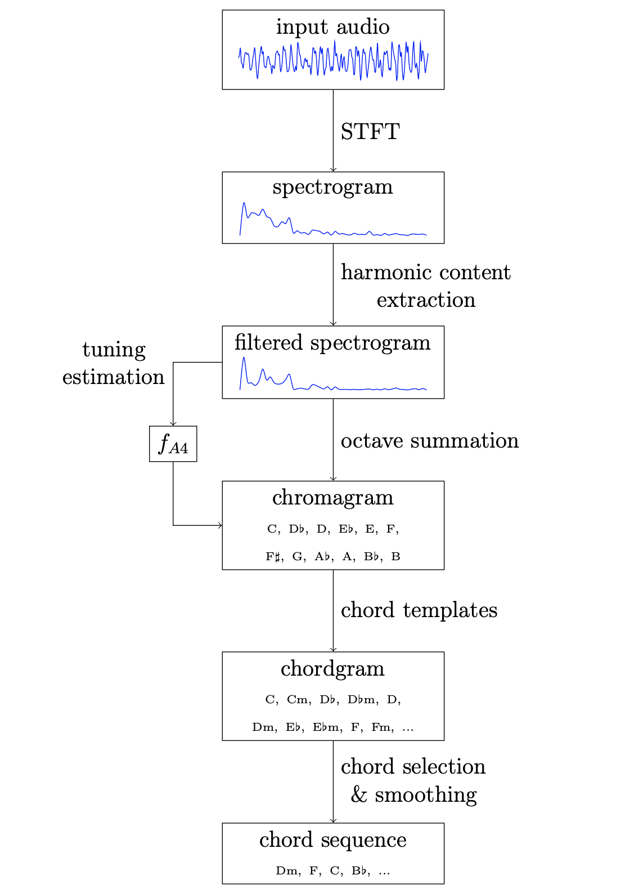

# Chord Detection Algorithm (Jupyter Notebooks)

## 1 . STFT experiments

First we explore the application of STFT to audio signals. Two different implementations, one using `numpy` and other using `scipy`.

Relevant libraries:
* numpy
* scipy
* librosa
* matplotlib

## 2 . Chromagram & Chordgram

Implementation of chord detection method proposed in [Bachelor Thesis: Design and Evaluation of a Simple Chord Detection Algorithm](https://www.fim.uni-passau.de/fileadmin/dokumente/fakultaeten/fim/lehrstuhl/sauer/geyer/BA_MA_Arbeiten/BA-HausnerChristoph-201409.pdf) by Christoph Hausner. 

Steps:
1. Load audio file
2. Compute spectrogram
3. Harmonic content extraction
4. Tuning estimation (to do)
5. Chromagram calculation
6. Chordgram calculation & chord detection